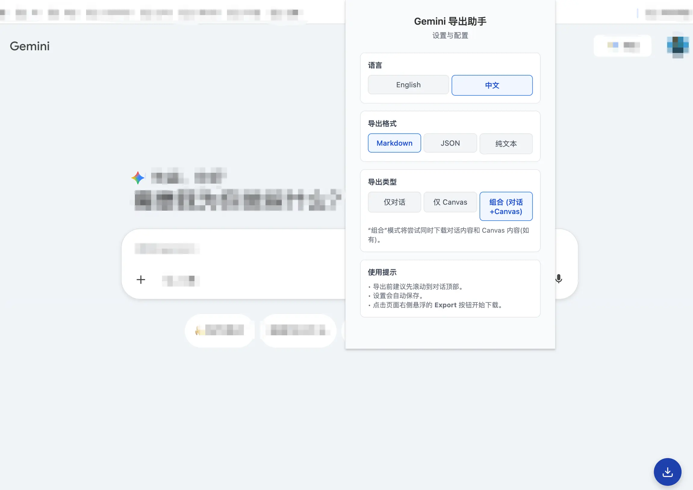

# Gemini Export Chrome Extension

A Chrome Extension that allows users to export their current Gemini chat history to local storage. Supports exporting as Markdown and JSON formats, with each conversation saved as a separate file.



## Features

- **Bulk Export**: Export current historical chats in one click.
- **Multiple Formats**: Support for Markdown (`.md`), JSON (`.json`), and Text (`.txt`).
- **Export Types**: Choose to export just the Dialog, the Canvas, or Both.
- **Thread Anchor Panel (Right Side)**: Shows message anchors for quick navigation in long threads. Supports Gemini structures like `user-query` (user message) and `model-response` (assistant response).
- **Anchor Panel Default Collapsed**: The right-side anchor panel is collapsed by default to avoid blocking normal reading. Click the panel toggle button to expand/collapse.
- **Generated Image Export**: Automatically downloads detected generated images in the conversation.
- **Watermark Removal (Experimental)**: Optional Gemini visible watermark removal during image export, with automatic fallback to original image download when removal is not possible.
- **Multi-language Support**: Interface available in English and Chinese.
- **Privacy Focused**: Runs entirely locally in your browser. No data is sent to external servers.

## Installation

1. Clone this repository or download the source code.
2. Open Google Chrome and navigate to `chrome://extensions/`.
3. Enable **Developer mode** in the top right corner.
4. Click **Load unpacked**.
5. Select the directory where you downloaded this project.

## Usage

1. Open [Gemini](https://gemini.google.com/).
2. Click the extension icon in the toolbar.
3. Configure your settings:
    - **Language**: English or Chinese.
    - **Export Format**: Markdown, JSON, or Text.
    - **Export Type**: Dialog, Canvas, or Both.
    - **Image Export / Watermark Removal**: Enable or disable `Remove Gemini visible watermark (experimental)`.
4. Click **Export** (or use the floating button on the page).
5. Wait for the process to finish and the ZIP file will automatically download.

### Thread Anchor Panel

- The panel is rendered on the right side of the chat page.
- Default behavior is **collapsed** to reduce visual obstruction.
- Click the panel toggle to expand and see all message anchors.
- Click an anchor item to jump directly to that message.
- Anchors are generated from detected message nodes (for example `user-query` and `model-response`).

### Image Export and Watermark Removal

- When generated images are present in the chat, the extension will download them alongside text export.
- If watermark removal is enabled, images are processed before download.
- If processing fails (for example due to fetch/CORS limitations or low detection confidence), the extension falls back to downloading the original image.
- Export logs include watermark stats: `Watermark removed: X, fallback: Y`.

## Project Structure

```
gemini-export/
├── manifest.json       # Extension configuration
├── assets/             # Icons and images
├── src/
│   ├── background/     # Service worker (orchestration)
│   ├── content/        # Content scripts (DOM interaction)
│   ├── popup/          # UI for the extension
│   └── lib/            # Utilities (formatting, zipping)
└── README.md           # This file
```

## Reference

This project is inspired by and references [gemini_chat_export](https://github.com/Sxuan-Coder/gemini_chat_export).

## Tech Stack

- **HTML/CSS/JS**: Core technologies.
- **Manifest V3**: The latest Chrome Extension standard.
- **JSZip**: For bundling files into a single download.

## Development

1. Make changes to the code in `src/`.
2. Go to `chrome://extensions/` and click the refresh icon on the Gemini Export card.
3. Test the changes on the Gemini website.
